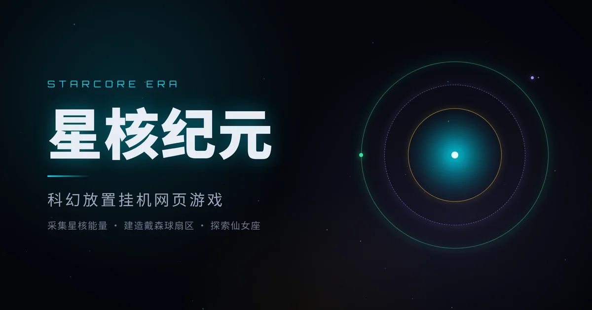

# StarCore Era

[简体中文](README.md) | **English**



A sci-fi idle web game. In 2387 AD, a colony ship arrives at the ruins of a
Dyson sphere in the Andromeda Galaxy. You run a StarCore civilization,
accumulating energy, exploring the stars, conquering strongholds and
collecting relics in the eternal contest between civilization and entropy,
growing on through "Singularity Restart" rebirth cycles.

## Gameplay Overview

- **Build**: 20 building types across 5 resources (Energy, Crystal, Alloy,
  Data, Dark Matter); costs escalate
- **Tech Tree**: 8 branches, 59 technologies driving production, combat,
  exploration and rebirth
- **Exploration**: 34 nodes across the StarCore, Stellar, Star Cluster,
  Star Arm and Galaxy layers; timed runs grant rewards
- **Units**: 4 unit types in a double counter-triangle; parallel training
  slots 1→3 via tech
- **PVE Strongholds**: 36 strongholds in 4 categories; garrison conquered
  ones for idle output, plus an endless expedition with rising depth
- **Relics**: 20 kinds drawn from rarity pools; 3 of the same rarity fuse
  into 1 of the next tier; 4 set bonuses; each relic can be enhanced up to
  level 20 with energy
- **Rebirth**: Singularity Restart; negative entropy unlocks a talent tree,
  infinite talents stack, and automation protocols play for you
- **Achievements**: 37 milestones tracked across rebirths, granting permanent
  bonuses
- **Daily Check-in**: streak-cycle rewards plus 3 weekly challenges

## Quick Start

Requires Node.js 22.12+ (24.20 used in development); pnpm 9 is invoked via
corepack (`packageManager` pins 9.15.4, fetched on first run).

```bash
git clone https://github.com/renlang119/starcore.git
cd starcore
corepack pnpm install       # install dependencies
corepack pnpm dev           # dev server at http://localhost:5173
```

Other common commands:

```bash
corepack pnpm build         # type-check + production build into dist/
corepack pnpm test          # unit / component tests
corepack pnpm lint:check    # ESLint
corepack pnpm format:check  # Prettier
corepack pnpm check         # full gate (build + test + conservation + lint + format)
```

## Tech Stack

Vue 3 · TypeScript · Vite · Pinia · Vue Router · decimal.js · localforage

Pure front-end, no backend; saves are kept locally in the browser (IndexedDB
with a localStorage backup).

Browser support: ES2020 build target, runs on Chrome/Edge 87+, Firefox 78+,
Safari 14+; both desktop and mobile layouts are supported.

## Project Structure

```text
starcore/
├─ src/
│  ├─ components/   27 components, grouped as ui / layout / home / relics / build
│  ├─ composables/  7 composables (breakpoints, Toast, action queue, onboarding, particles, …)
│  ├─ data/         9 data tables (buildings, tech, exploration, strongholds, relics, achievements, expeditions, units, navigation)
│  ├─ lib/          6 core modules (decimal math, save, formatting, offline gains, random, effect system)
│  ├─ router/       route definitions
│  ├─ stores/       11 Pinia stores (resources, buildings, research, military, combat,
│  │                exploration, relics, rebirth, achievements, daily, game)
│  ├─ styles/       8 style modules (tokens, base, fonts, buttons, Toast, animations, background, utilities)
│  ├─ tests/        test harness (vitest setup and shared helpers)
│  ├─ views/        9 views (home, build, tech, map, army, battle, relics, rebirth, achievements)
│  └─ App.vue / main.ts / version.ts / style.css
├─ docs/            11 specification documents (in Chinese), see Documentation (plus archived history)
├─ public/          favicon and self-hosted fonts (Orbitron, JetBrains Mono)
├─ scripts/         quality scripts (count conservation check)
├─ changelog/       version history; active file and three archives
├─ deploy.sh        deployment script
└─ project configs (vite.config.ts, vitest.config.ts, tsconfig*.json, eslint.config.js)
```

## Quality

- **Unit / component tests**: Vitest + @vue/test-utils + jsdom; 33 test files,
  476 cases
- **Types & conventions**: vue-tsc type checking in the build; ESLint and
  Prettier pass with zero output
- **Count conservation**: `scripts/check-conservation.mjs` validates document
  counts, achievement text links and test hard assertions against real data
  (`corepack pnpm check:conservation`)

## Documentation

> All design documents are currently written in Chinese.

- [游戏设定与架构](docs/游戏设定与架构.md) · Game Design & Architecture
- [游戏数值设定规范](docs/游戏数值设定规范.md) · Numerical Design Specification
- [设计Token规范](docs/设计Token规范.md) · Design Token Specification
- [组件与按钮设计规范](docs/组件与按钮设计规范.md) · Components & Buttons Specification
- [交互状态规范](docs/交互状态规范.md) · Interaction States Specification
- [氛围视觉规范](docs/氛围视觉规范.md) · Atmosphere & Visuals Specification
- [体验增强设计规范](docs/体验增强设计规范.md) · Experience Enhancements Specification
- [动效规范](docs/动效规范.md) · Motion Design Specification
- [存档与数据安全规范](docs/存档与数据安全规范.md) · Save Data & Security Specification
- [弹窗与确认流规范](docs/弹窗与确认流规范.md) · Dialogs & Confirmation Flows Specification
- [图标设计规范](docs/图标设计规范.md) · Icon Design Specification

## Version History

- [changelog.md](changelog/changelog.md) · from v1.06, newest first
- [changelog-v0.71-v1.05.md](changelog/changelog-v0.71-v1.05.md) · v0.71 to v1.05 archive
- [changelog-v0.36-v0.70.md](changelog/changelog-v0.36-v0.70.md) · v0.36 to v0.70 archive
- [changelog-v0.01-v0.35.md](changelog/changelog-v0.01-v0.35.md) · v0.01 to v0.35 archive

## Deployment

A pure static SPA. The build output goes to `dist/` and is synced to a
static site by `./deploy.sh` (site URL and target directory are configured
via environment variables; see the script for details).

## License

[MIT](LICENSE) © 2026 renlang119

UI fonts Orbitron and JetBrains Mono are licensed under the SIL Open Font
License 1.1.
