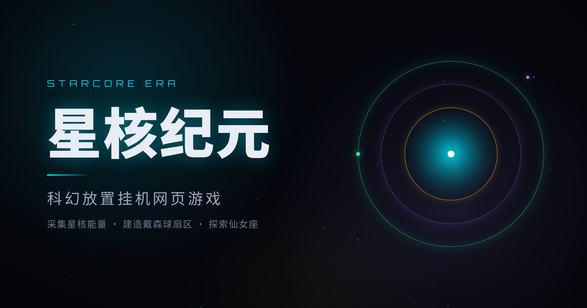

# 星核纪元 · StarCore Era

**简体中文** | [English](README.en.md)



科幻题材的放置/挂机网页游戏：公元 2387 年，殖民舰抵达仙女座星系的戴森球遗迹，
玩家经营星核文明，在「文明与熵的永恒博弈」中积累能量、探索星域、征战据点、
收集遗物，并通过「奇点重启」转生循环不断成长。

## 玩法概览

- **建造**：5 类资源（能量/晶体/合金/数据/暗物质）共 20 种建筑，成本递增
- **科技树**：8 大分支 59 项科技，驱动产出、战斗、探索与转生
- **探索**：星核层 + 恒星系层 + 星团层 + 星臂层 + 星系层 + 深空层共 34 个节点，定时完成发放奖励
- **部队**：4 种兵种双三角克制，训练并行槽 1→3（科技扩展）
- **据点 PVE**：4 类 36 据点，胜利后可驻扎挂机产出；另有深度递增的「无尽远征」
- **遗物**：20 种稀有度池抽取，同稀有度 3 合 1 升档，4 组套装加成；每件遗物可消耗能量强化至 20 级
- **转生**：奇点重启，负熵点亮天赋树；无限天赋可重复购买叠加，自动协议解放双手
- **成就**：37 个里程碑跨转生累计，解锁永久加成
- **每日签到**：连击循环奖励 + 每周 3 项周期挑战

## 快速开始

环境要求：Node.js 22.12 及以上（开发环境实测 24.20），pnpm 9 经 corepack
调用（`packageManager` 锁定 9.15.4，首次运行自动拉取）。

```bash
git clone https://github.com/renlang119/starcore.git
cd starcore
corepack pnpm install       # 安装依赖
corepack pnpm dev           # 启动开发服务器，浏览器打开 http://localhost:5173
```

其他常用命令：

```bash
corepack pnpm build         # 类型检查 + 生产构建，产物在 dist/
corepack pnpm test          # 运行单元/组件测试
corepack pnpm lint:check    # ESLint 检查
corepack pnpm format:check  # Prettier 检查
corepack pnpm check         # 全量关卡（build + test + 守恒 + lint + format）
```

## 技术栈

Vue 3 · TypeScript · Vite · Pinia · Vue Router · decimal.js · localforage

纯前端，无后端；存档保存在浏览器本地（IndexedDB + localStorage 备份）。

浏览器支持：构建目标 ES2020，Chrome/Edge 87+、Firefox 78+、Safari 14+
均可运行；桌面与移动端布局均已适配。

## 项目结构

```text
starcore/
├─ src/
│  ├─ components/   27 个组件，按 ui / layout / home / relics / build 分组
│  ├─ composables/  7 个组合式函数（断点、Toast、行动队列、引导、粒子等）
│  ├─ data/         9 份数据表（建筑、科技、探索、据点、遗物、成就、远征、部队、导航）
│  ├─ lib/          6 个基础模块（高精度数值、存档、格式化、离线收益、随机、效果系统）
│  ├─ router/       路由定义
│  ├─ stores/       11 个 Pinia store（资源、建筑、研究、军事、战斗、探索、
│  │                遗物、转生、成就、签到、游戏）
│  ├─ styles/       8 个样式模块（tokens、基础、字体、按钮、Toast、动效、背景、工具类）
│  ├─ tests/        测试装置（vitest setup 与公共 helper）
│  ├─ views/        9 个页面视图（主界面、建造、科技、地图、军队、战斗、遗物、转生、成就）
│  └─ App.vue / main.ts / version.ts / style.css
├─ docs/            十一册规范文档，见「文档索引」（含 archive 历史归档）
├─ public/          favicon 与本地字体（Orbitron、JetBrains Mono）
├─ scripts/         质量脚本（计数守恒检查）
├─ changelog/       版本历史三档（活跃档 changelog.md 与两份历史存档）
├─ deploy.sh        部署脚本
└─ 工程配置（vite.config.ts、vitest.config.ts、tsconfig*.json、eslint.config.js）
```

## 质量

- **单元/组件测试**：Vitest + @vue/test-utils + jsdom，32 个测试文件 491 个用例
- **类型与规范**：构建内置 vue-tsc 类型检查；ESLint 与 Prettier 全量检查零输出
- **计数守恒**：`scripts/check-conservation.mjs` 校验文档计数、成就文案联动与
  测试硬断言，防止数值漂移（`corepack pnpm check:conservation`）

## 文档索引

- [游戏设定与架构](docs/游戏设定与架构.md)：世界观、系统设计与技术架构
- [游戏数值设定规范](docs/游戏数值设定规范.md)：全数值口径与梯度，改数值须同步
- [设计Token规范](docs/设计Token规范.md)：间距、字号、颜色等设计 token 的映射
- [组件与按钮设计规范](docs/组件与按钮设计规范.md)：组件与按钮的形态、状态与用法
- [交互状态规范](docs/交互状态规范.md)：加载、空态、错误等交互反馈与状态语义
- [氛围视觉规范](docs/氛围视觉规范.md)：氛围与视觉系统（层次、渐变、光效）
- [体验增强设计规范](docs/体验增强设计规范.md)：快速操作、空态、断点等体验增强项
- [动效规范](docs/动效规范.md)：全项目动效参数唯一出处（交互反馈/转场/粒子/循环动画）
- [存档与数据安全规范](docs/存档与数据安全规范.md)：存档读写、校验、导入导出与错误恢复
- [弹窗与确认流规范](docs/弹窗与确认流规范.md)：确认流分级、弹窗结构与各确认流定标
- [图标设计规范](docs/图标设计规范.md)：图标绘制规范与统一化口径

## 版本历史

- [changelog.md](changelog/changelog.md)：v0.63 起，新条目置顶
- [changelog-v0.30-v0.62.md](changelog/changelog-v0.30-v0.62.md)：v0.30 至 v0.62 存档
- [changelog-v0.01-v0.29.md](changelog/changelog-v0.01-v0.29.md)：v0.01 至 v0.29 存档

## 部署

纯静态 SPA。构建产物在 `dist/`，由 `./deploy.sh` 同步至静态站点
（站点地址/目录经环境变量配置，见脚本内说明）。

## 许可证

[MIT](LICENSE) © 2026 renlang119

界面字体 Orbitron 与 JetBrains Mono 均以 SIL Open Font License 1.1 授权。
